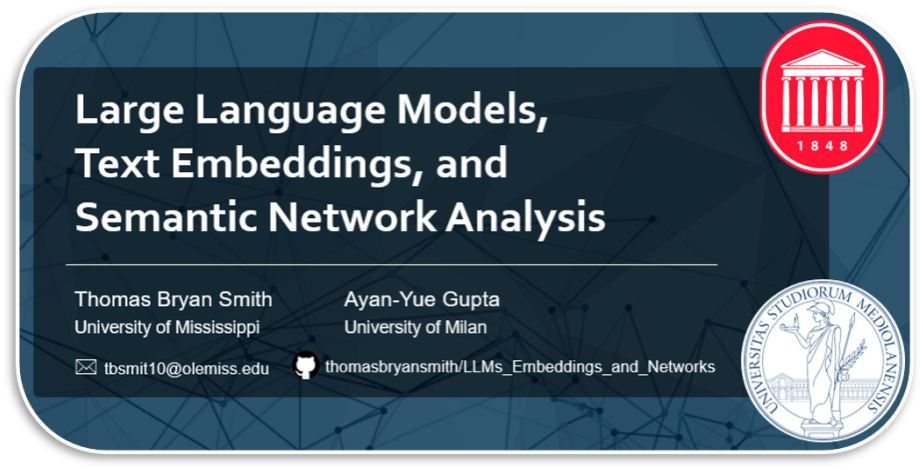

  
This 6-hour session offers a practical introduction to Python and the synthesis of network analysis with natural language processing methods, including large language models (LLMs). This begins with an introduction to text data management and preprocessing in Python. We introduce embedding, discussing its development in the early 2010s and demonstrating practical applications. 
 
We start with word embeddings and word2vec, and the evolution from static word embeddings to contextual token embeddings through transformer architecture (e.g., BERT). Recent developments in post-ChatGPT generative LLMs, and how such developments (e.g. reinforcement learning from human feedback, contrastive learning) have improved text embedding generation, will eventually be explored with LLM2Vec. 
 
The second half will guide attendees through the construction and analysis of networks derived of text embeddings. This will include topic modelling (BERT and LLM2Vec), and approaches to constructing network representations derived of topic embeddings – modelling the relational structure between the identified topics. This second session will close with a demonstration of analyses which might be performed on the resulting network, such as backbone extraction (e.g., disparity filter, LANS) and the interpretation of the networks’ features.
